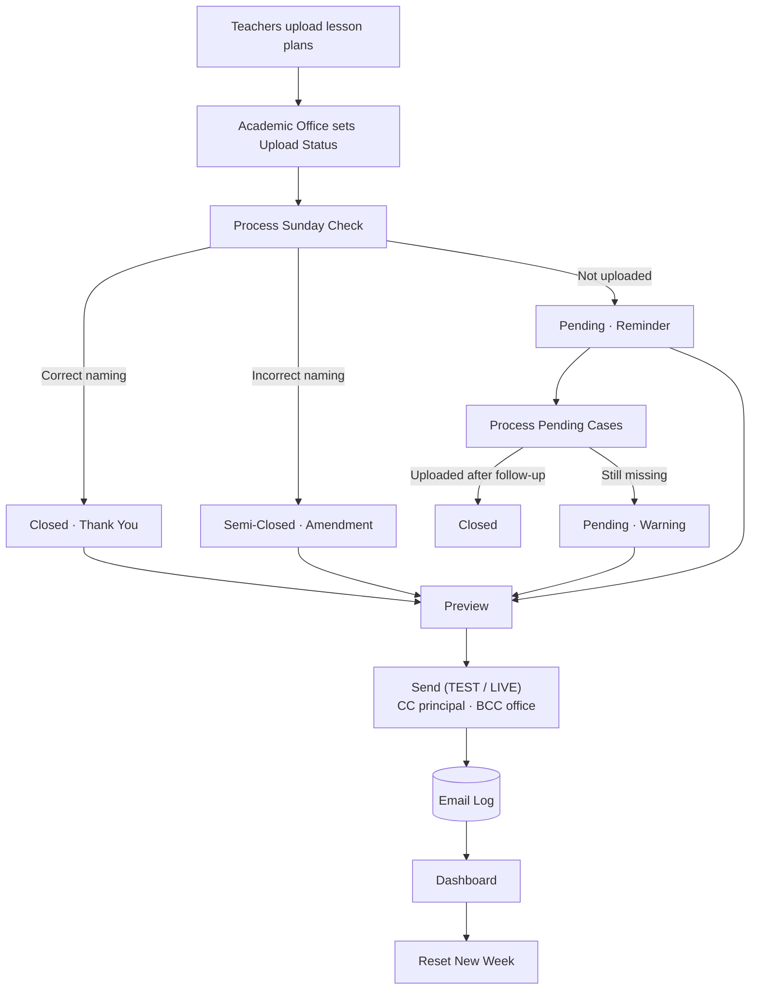

# Lesson Plan Tracking System v1.0

Academic accountability and lesson plan tracking system built with Google Apps Script.

## Screenshots

> Illustrations generated by running the project's real code against **fictional sample data**. No real school, staff or student data is included.

📖 **[Read the full illustrated guide](docs/GUIDE.md)**: every screen, tab, menu item, dialog and email, explained.

**Action Center after Sunday processing: case status, escalation and email type**

**Dashboard: weekly status and academic-year overview**

**Amendment email with the configurable signature**

### Menus

**Lesson Plan Tracker menu**

## Overview

The Lesson Plan Tracking System is a Google Sheets and Google Apps Script–based automation platform designed to streamline lesson plan monitoring, accountability, and communication within an academic institution.

The system replaces manual tracking processes with an automated workflow that monitors lesson plan submissions, identifies compliance status, generates professional email communications, logs all actions, and provides real-time dashboards for academic leadership.

---

## Problem Statement

Monitoring lesson plan submissions across multiple teachers can be time-consuming and inconsistent. Academic leaders often spend significant time:

* Tracking lesson plan uploads
* Following up with teachers
* Sending repetitive emails
* Recording accountability actions
* Preparing compliance reports
* Monitoring submission trends

The Lesson Plan Tracking System centralizes and automates these processes within a single platform.

---

## Key Features

### Weekly Processing Engine

* Processes weekly lesson plan submissions
* Identifies missing lesson plans
* Detects submission issues
* Assigns accountability actions automatically

### Accountability Workflow

The system supports four communication levels:

| Email Type | Purpose                         |
| ---------- | ------------------------------- |
| Thank You  | Lesson plan submitted correctly |
| Amendment  | Lesson plan requires correction |
| Reminder   | Lesson plan missing             |
| Warning    | Continued non-compliance        |

### Professional HTML Email Automation

* Dynamic teacher information
* Grade-specific messaging
* Trimester and week variables
* Professional Academic Dean signature
* Automated notification footer
* TEST and LIVE modes
* Principal CC support
* Academic Office BCC support

### Dashboard Analytics

Provides real-time visibility into:

* Teacher compliance status
* Weekly lesson plan monitoring
* Academic year communication history
* Compliance scores
* Accountability trends

### Email Logging

Every communication generated by the system is automatically recorded to create a complete audit trail for reporting and accountability purposes.

### Settings Management

Administrators can configure:

* Academic Year
* Current Trimester
* Current Week
* TEST / LIVE Mode (and a `Test Email` address for TEST mode)
* Email signature (optional `Sender Name`, `Sender Email` and `Mission Statement` rows)
* Principal Emails
* Academic Office Email
* System Parameters

without modifying any code.

---

## System Components

### Google Apps Script Files

| File         | Purpose                            |
| ------------ | ---------------------------------- |
| Code.gs           | Menu and system entry points       |
| ProcessSunday.gs  | Weekly (Sunday) processing rules   |
| ProcessPending.gs | Follow-up and escalation           |
| EmailTemplates.gs | Email rendering and preview        |
| Send Email.gs     | TEST / LIVE sending with CC and BCC |
| EmailLog.gs       | Duplicate-safe email logging       |
| Dashboard.gs      | Dashboard generation and analytics |
| Settings.gs       | Configuration management           |
| Reset.gs          | Weekly reset                       |

### HTML Templates

| File              | Purpose                     |
| ----------------- | --------------------------- |
| MasterLayout.html | Shared email layout         |
| ThankYou.html     | Compliance acknowledgement  |
| Amendment.html    | Correction request          |
| Reminder.html     | Missing submission reminder |
| Warning.html      | Escalation notification     |

---

## Technology Stack

* Google Sheets
* Google Apps Script (JavaScript)
* HTML/CSS
* GmailApp
* Spreadsheet-Based Configuration

---

## Workflow

---

## Benefits

* Reduces administrative workload
* Standardizes teacher communication
* Improves accountability and transparency
* Creates a permanent communication log
* Supports data-driven academic leadership
* Saves time through automation

---

## Project Status

**Version:** 1.0

**Status:** Production Ready

The system is designed for real-world implementation within an academic institution to support lesson plan management, teacher accountability, instructional leadership, and operational efficiency.

---

## Future Development

Potential future enhancements include:

* Automated scheduled email delivery
* Multi-campus support
* Teacher self-service portal
* Monthly compliance reporting
* Advanced analytics dashboard
* AI-assisted lesson plan review
* Power BI / Looker Studio integration

---

## Author

**Randa El Gawish**

Academic Dean | Educational Systems Builder

Designed and developed to improve academic operations, accountability, and instructional leadership through automation and data-driven workflows.

---

## License

[MIT](LICENSE) © Randa ELGawish

[LinkedIn](https://www.linkedin.com/in/randaelgawishegy) · [GitHub](https://github.com/RandaELGawish93)
