# Lesson Plan Tracking System: illustrated guide

How the weekly lesson plan check works, from upload status to the right email.

> Every picture in this guide is an **illustration filled with fictional sample data** (names like *Sarah Collins*, emails at `example.edu`). No real school, staff or student data appears anywhere in this repository.

## Contents

- [Menu](#menu)
- [Weekly workflow](#weekly-workflow)
- [Emails](#emails)
- [Other tabs](#other-tabs)

## Menu

### Lesson Plan Tracker menu

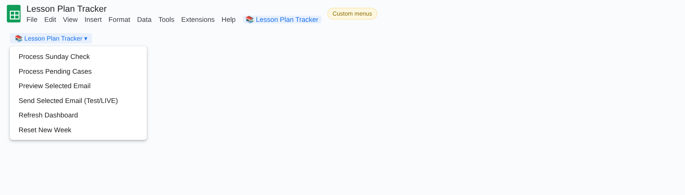

| Item | What it does |
|---|---|
| **Process Sunday Check** | Reads each teacher's *Upload Status* and fills in the Case Status, Escalation Level, Email Sent type and Notes. Rows already Closed or Semi-Closed are skipped. |
| **Process Pending Cases** | Follows up on Pending cases: closes those uploaded after the reminder, and escalates a second miss from Reminder to Warning. |
| **Preview Selected Email** | Shows the email for the selected teacher row exactly as it will be sent. |
| **Send Selected Email (Test/LIVE)** | Sends the email for the selected row after a confirmation. In TEST mode it goes only to the test address; in LIVE mode it goes to the teacher, CCs the division principal and BCCs the Academic Office. |
| **Refresh Dashboard** | Rebuilds the weekly counts, the cases needing attention and the academic-year overview. |
| **Reset New Week** | After a Yes/No confirmation, clears the weekly columns (Upload Status to Notes) while keeping the teacher list. |

## Weekly workflow

### Action Center before processing

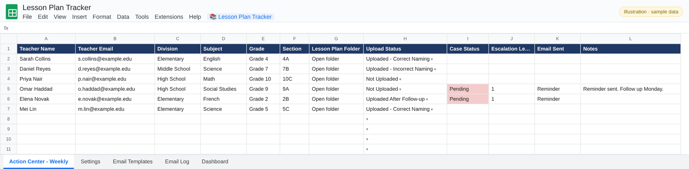

One row per teacher and class. During the week the Academic Office sets **Upload Status** from the dropdown: *Uploaded – Correct Naming*, *Uploaded – Incorrect Naming*, *Not Uploaded* or *Uploaded After Follow-up*.

### Sunday processing

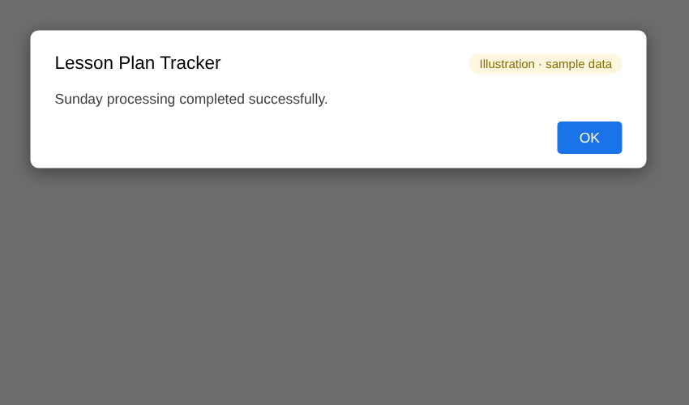

Running **Process Sunday Check** (and **Process Pending Cases** for follow-ups) applies the rules below.

### Action Center after processing

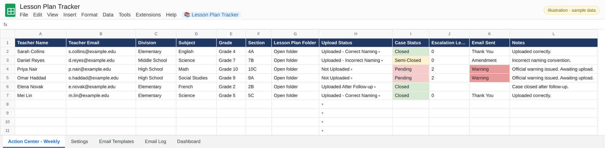

Each row now has a case status, escalation level and the email to send:

| Upload Status | Case Status | Email |
|---|---|---|
| Uploaded – Correct Naming | Closed | Thank You |
| Uploaded – Incorrect Naming | Semi-Closed | Amendment |
| Not Uploaded (first time) | Pending, level 1 | Reminder |
| Still not uploaded (follow-up) | Pending, level 2 | Warning |
| Uploaded After Follow-up | Closed | none |

### Preview selected email

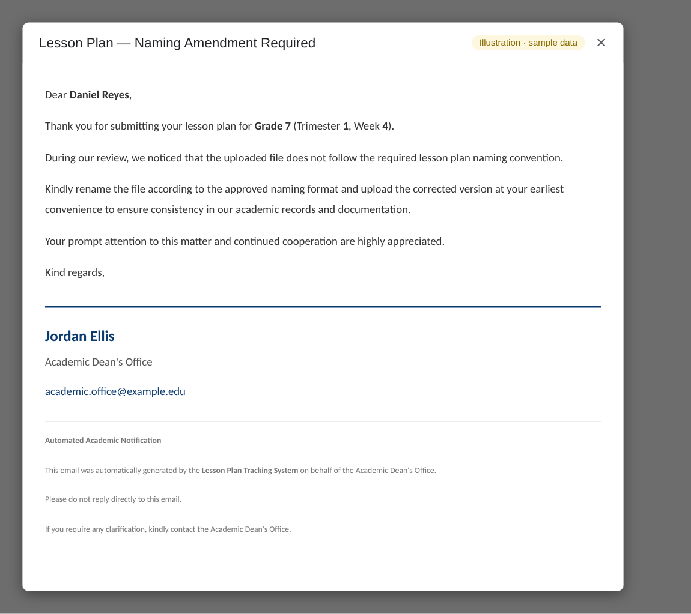

Select a teacher row and choose **Preview Selected Email** to see the finished email.

### Send: confirmation

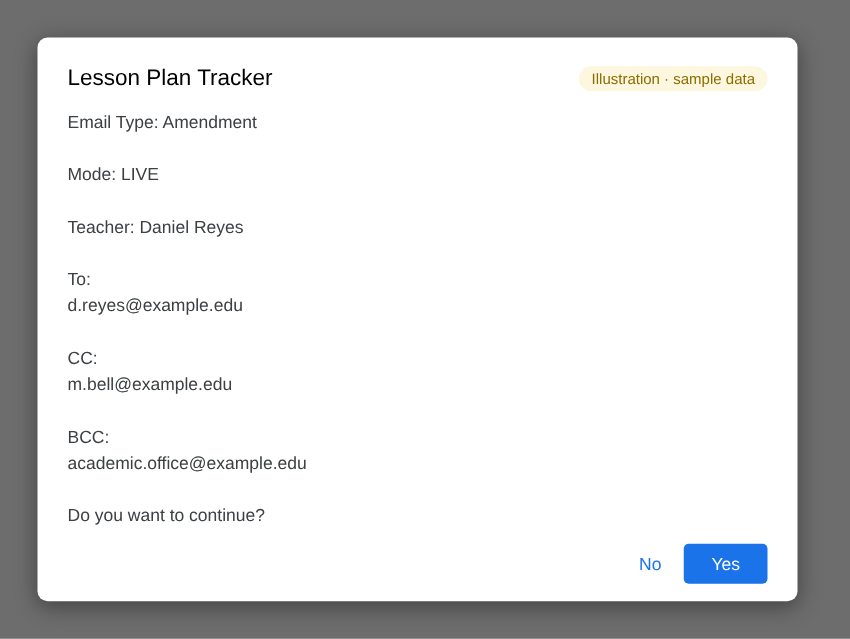

**Send Selected Email** shows the mode, the recipient, the CC (the principal of the teacher's division) and the BCC (the Academic Office) and asks you to confirm.

### Send: done

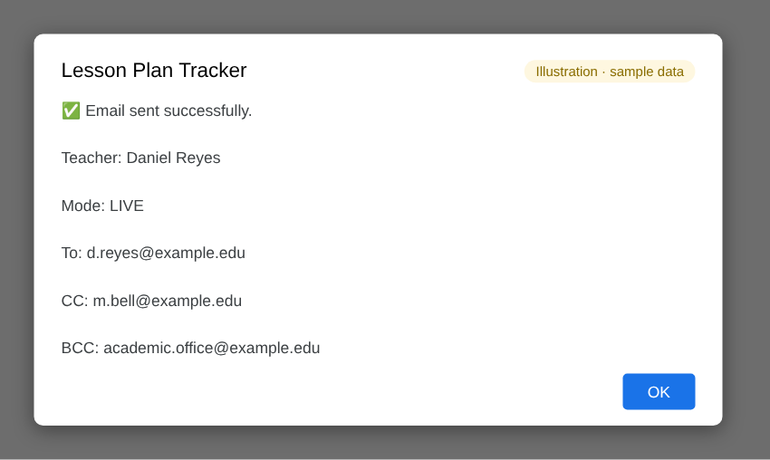

Confirms the email was sent and to whom.

## Emails

All four use the same layout. The signature (name, email and an optional mission statement) comes from the Settings tab.

### Thank You

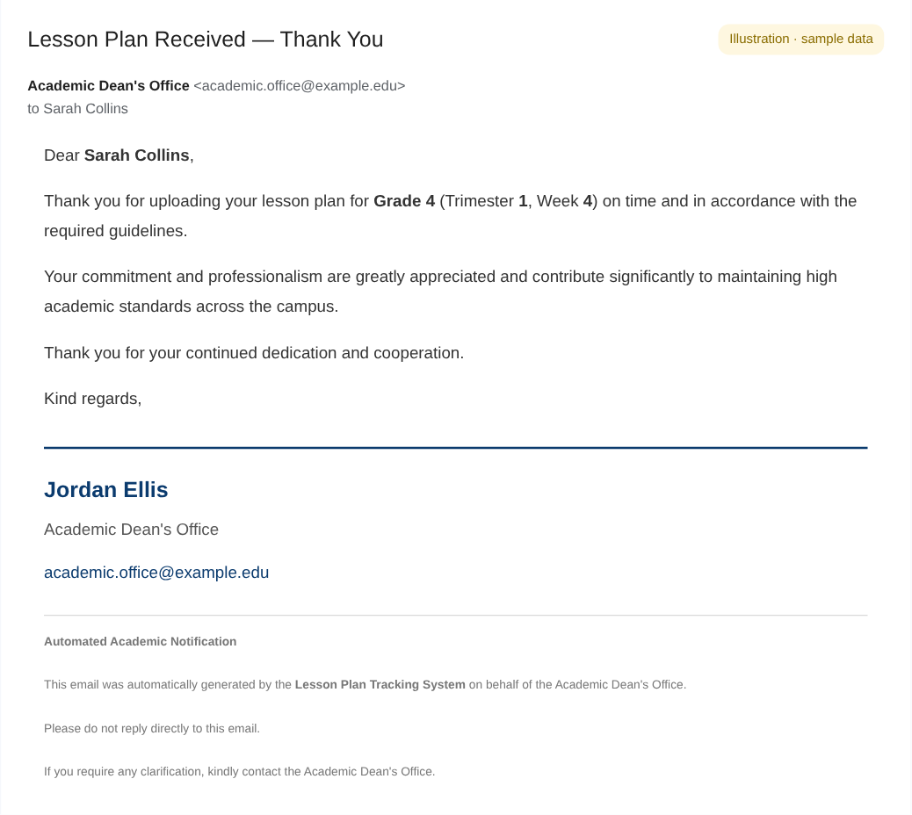

The lesson plan was uploaded on time and named correctly.

### Amendment

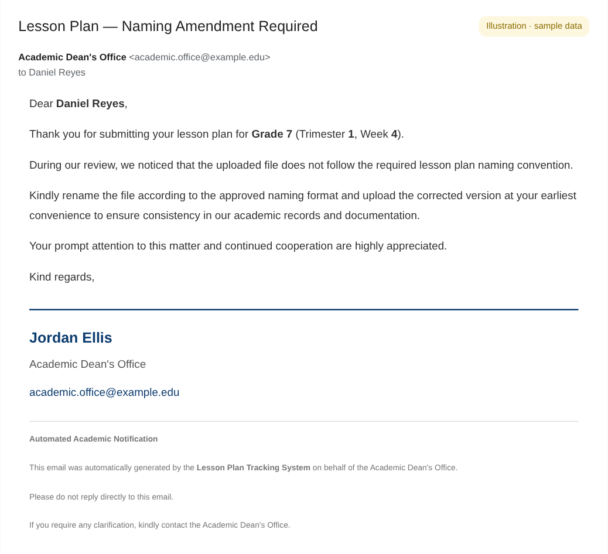

The file was uploaded but doesn't follow the naming convention.

### Reminder

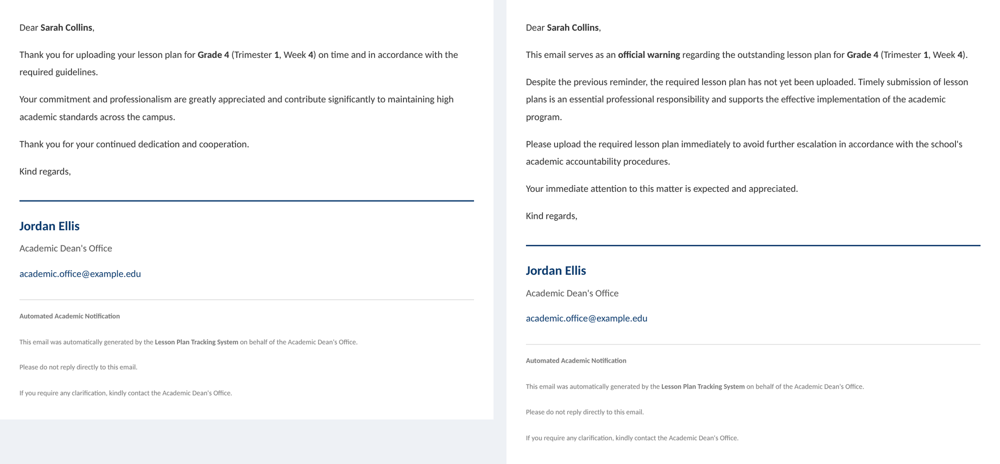

No lesson plan has been uploaded yet.

### Warning

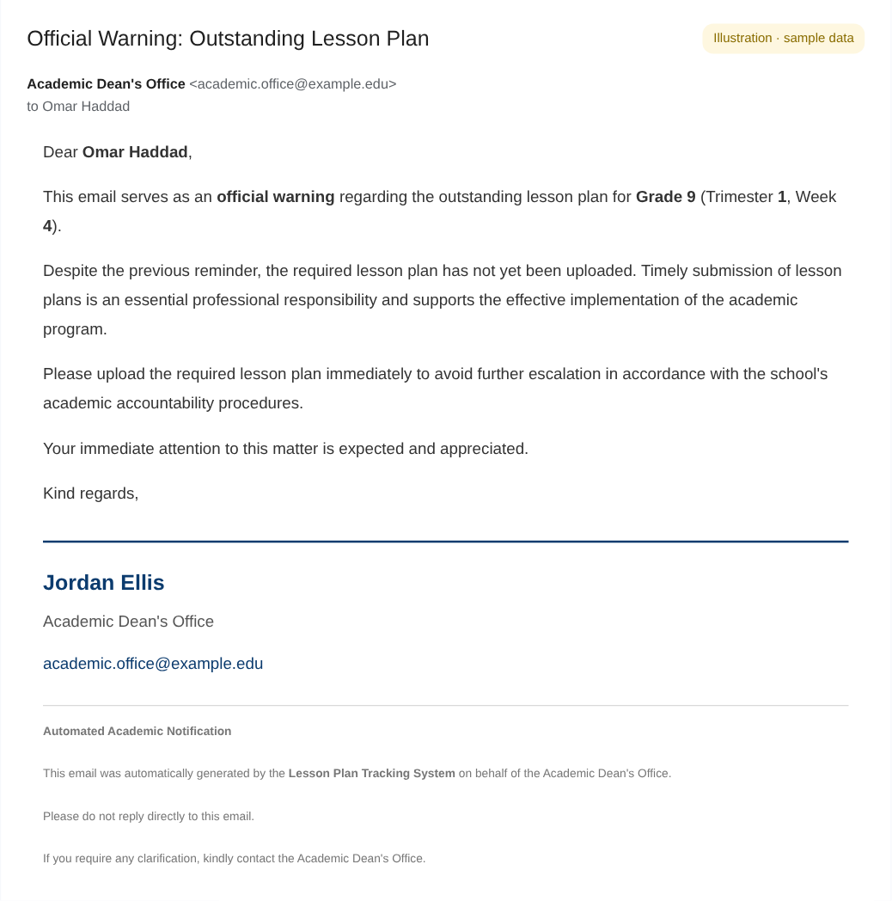

An official warning after the reminder was not acted on.

## Other tabs

### Dashboard

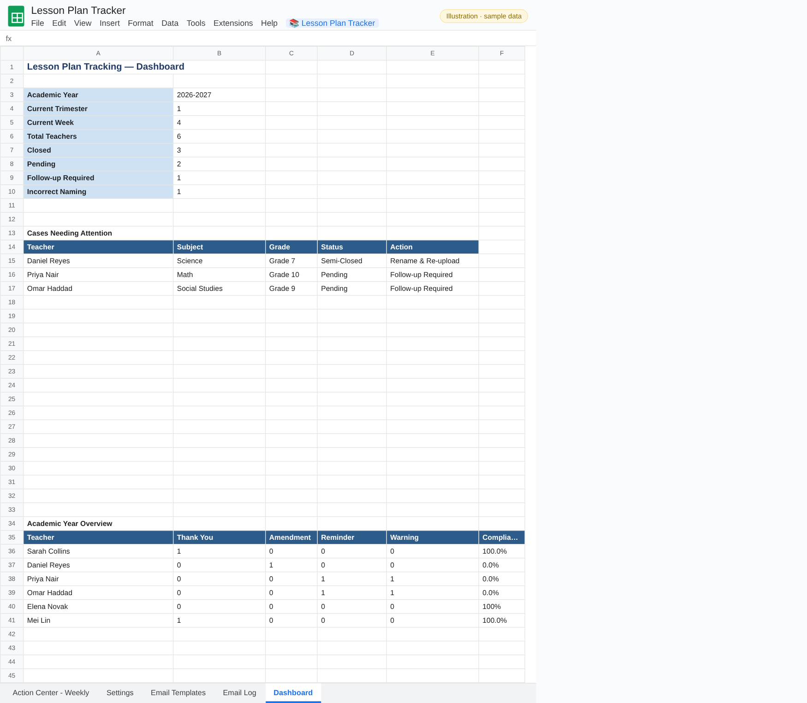

The current year, trimester and week; totals of closed, pending, follow-up and incorrect-naming cases; a *Cases Needing Attention* list; and an academic-year overview counting each teacher's Thank You, Amendment, Reminder and Warning emails with a compliance percentage.

### Settings

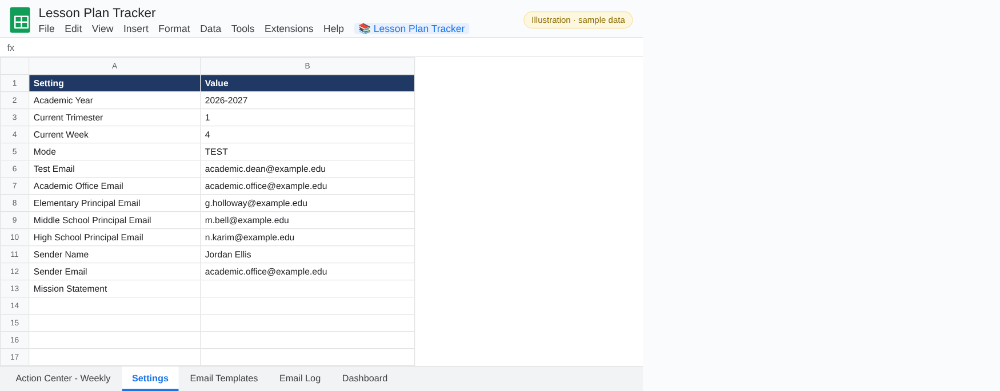

Academic year, current trimester and week, **Mode** (TEST or LIVE) and the test address, the Academic Office email (BCC), the three principals' emails (CC) and the signature fields.

### Email Templates

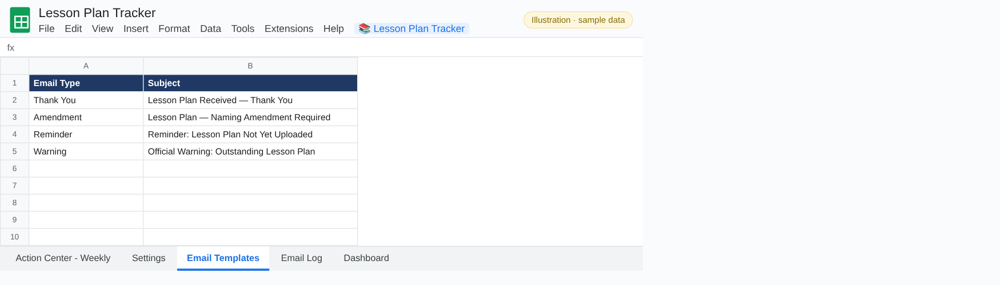

The subject line for each email type. Edit them here without touching the code.

### Email Log

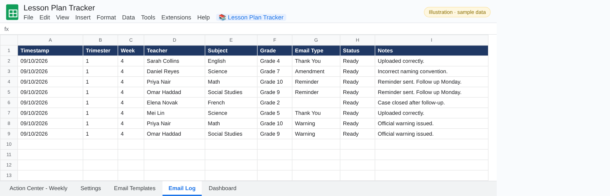

One line per teacher, week and email type, so the same email is never logged twice.

---

[← Back to the README](../README.md)
